# Student Course Management System (MySQL)

This project models a complete student-course-instructor relationship database using MySQL. It contains 5 core tables:

- **Departments**
- **Instructors**
- **Students**
- **Courses**
- **Enrollments**

---

## Key Insight Queries & Outputs

1. **Which students got an 'A' grade in any course?**  
   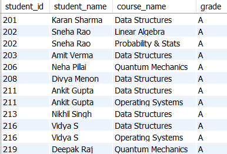

2. **How many students are there in each department?**  
   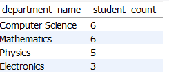

3. **What is the average grade per course?**  
   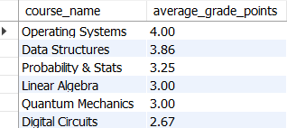

4. **Which instructor teaches which courses?**  
   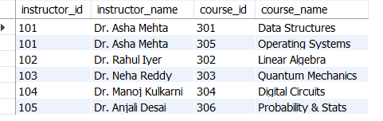

5. **Which students are in the Computer Science department?**  
   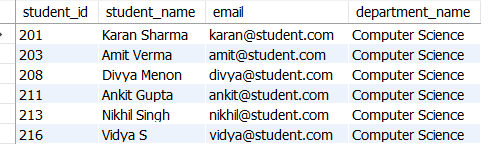

6. **What are the most recently enrolled students?**  
   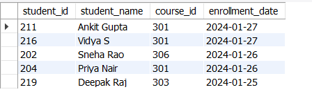

7. **What are the names and emails of all instructors?**  
   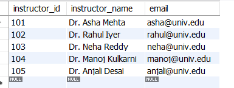

8. **Which student has enrolled in the most number of courses?**  
   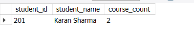

9. **Which course has the highest number of enrollments?**  
   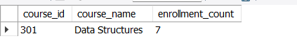

10. **What is the distribution of grades in each course?**  
    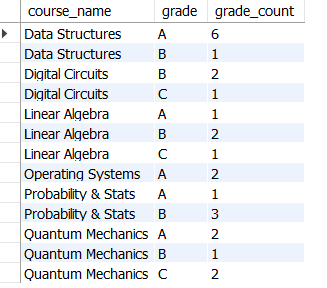

11. **Which instructors were hired before 2015?**  
    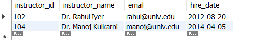

12. **Which students were born after the year 2001?**  
    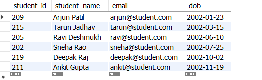

---
